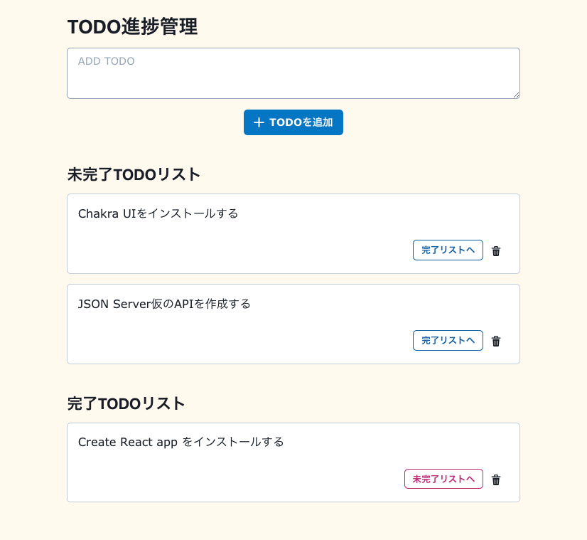
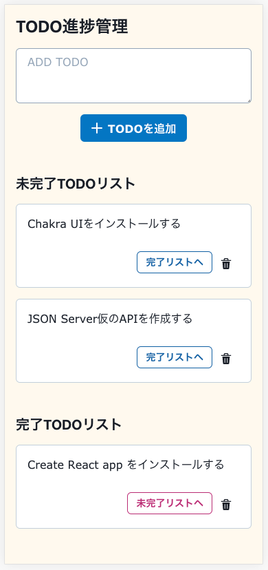

# 基礎から学ぶ React/React Hooks

著書「[基礎から学ぶ React/React Hooks（C&R研究所）](https://www.amazon.co.jp/dp/486354359X/)」のサンプルコード集のページです。

各サンプルコードは一部を除き[CodeSandbox](https://codesandbox.io/)上にあります。CodeSandbox画面右上にある「Fork」をクリックすると、内容をコピーした新しいSandBoxが作成され自由に編集できるようになります。

補足情報などもこのページで更新していく予定です。


## 更新情報

- [2021.09.26] p172（SECTION24） `App.js`ファイル内に記載漏れがありました。コードの先頭に`import React, { useState } from "react"`を追記しないとエラーが出て動きません。
大変お手数をお掛けしますがご確認宜しくお願いします。

|タイトル|ページ|補足|
|:--|:--:|:--|
|[04-テキスト入力フォーム](https://codesandbox.io/s/04-tekisutorulihuomu-df7ww)|p172|書籍中のサンプルコード一行目に`import React, { useState } from "react";`が抜けていました|


## CHAPTER1 Reactを始めるために必要なJavaScriptの知識

### 変数と宣言

|タイトル|ページ|補足|
|:--|:--:|:--|
|[01-変数と宣言_スコープ](https://codesandbox.io/s/01-bianshutoxuanyansukopu-60ofq)|p15||
|[01-変数と宣言_ローカルスコープ](https://codesandbox.io/s/01-bianshutoxuanyanrokarusukopu-4t60z)|p16||
|[01-変数と宣言_const[ES2015]](https://codesandbox.io/s/01-bianshutoxuanyanconstes2015-sjqlk)|p18||
|[01-変数と宣言_let[ES2015]-01](https://codesandbox.io/s/01-bianshutoxuanyanletes2015-01-cupbr)|p18||
|[01-変数と宣言_let[ES2015]-02](https://codesandbox.io/s/01-bianshutoxuanyanletes2015-02-0m151)|p18||

### データ型

|タイトル|ページ|補足|
|:--|:--:|:--|
|[01-データ型_テンプレートリテラル[ES2015]](https://codesandbox.io/s/01-detaxingtenpuretoriterarues2015-q7kn0)|p22||

### 演算子

|タイトル|ページ|補足|
|:--|:--:|:--|
|[01-演算子_比較演算子_等価演算子を利用するケース](https://codesandbox.io/s/01-yansuanzibijiaoyansuanzidengjiayansuanziwoliyongsurukesu-9xxxn)|p26||
|[01-演算子_比較演算子_大なり演算子と小なり演算子](https://codesandbox.io/s/01-yansuanzibijiaoyansuanzidanariyansuanzitoxiaonariyansuanzi-orn0t)|p28||
|[01-演算子_論理演算子](https://codesandbox.io/s/01-yansuanzilunliyansuanzi-58mdw)|p29||
|[01-演算子_短絡演算子](https://codesandbox.io/s/01-yansuanziduanluoyansuanzi-wgs4i)|p30||
|[01-演算子_条件（三項）演算子](https://codesandbox.io/s/01-yansuanzitiaojiansanxiangyansuanzi-lyvr9)|p31||

### 関数と宣言

|タイトル|ページ|補足|
|:--|:--:|:--|
|[01-関数と宣言_functionを利用した関数宣言](https://codesandbox.io/s/01-guanshutoxuanyanfunctionwoliyongsitaguanshuxuanyan-xzhjs)|p32||
|[01-関数と宣言_無名関数で宣言（関数式）](https://codesandbox.io/s/01-guanshutoxuanyanwumingguanshudexuanyanguanshushi-4yc95)|p33||
|[01-関数と宣言_アロー関数式による定義 [ES2015]](https://codesandbox.io/s/01-guanshutoxuanyanaroguanshushiniyorudingyi-es2015-b1uuq)|p33||

### 引数

|タイトル|ページ|補足|
|:--|:--:|:--|
|[01-引数](https://codesandbox.io/s/01-yinshu-hq29z)|p36||
|[01-引数_コールバック関数](https://codesandbox.io/s/01-yinshukorubatukuguanshu-4d9os)|p36||
|[01-引数_デフォルト引数 [ES2015]](https://codesandbox.io/s/01-yinshudehuorutoyinshu-es2015-muof6)|p37||
|[01-引数_可変長引数 [ES2015]](https://codesandbox.io/s/01-yinshukebianchangyinshu-es2015-empjv)|p37||
|[01-引数_引数の分割代入[ES2015]-01](https://codesandbox.io/s/01-yinshuyinshunofengedairues2015-01-jo7cu)|p38||
|[01-引数_引数の分割代入[ES2015]-02](https://codesandbox.io/s/01-yinshuyinshunofengedairues2015-02-qg9k5)|p38||

### 条件分岐とループ

|タイトル|ページ|補足|
|:--|:--:|:--|
|[01-条件分岐とループ_if文](https://codesandbox.io/s/01-tiaojianfenqitorupuifwen-ejiq7)|p39||
|[01-条件分岐とループ_switch文-01](https://codesandbox.io/s/01-tiaojianfenqitorupuswitchwen-01-0bzs1)|p41||
|[01-条件分岐とループ_switch文-02](https://codesandbox.io/s/01-tiaojianfenqitorupuswitchwen-02-xp3rt)|p42||
|[01-条件分岐とループ_for文](https://codesandbox.io/s/01-tiaojianfenqitorupuforwen-hi197)|p43||
|[01-条件分岐とループ_for...in文](https://codesandbox.io/s/01-tiaojianfenqitorupuforinwen-hiddf)|p43||
|[01-条件分岐とループ_for...of文 [ES2015]](https://codesandbox.io/s/01-tiaojianfenqitorupuforofwen-es2015-wwvqv)|p44||
|[01-条件分岐とループ_while文](https://codesandbox.io/s/01-tiaojianfenqitorupuwhilewen-92cfl)|p45||
|[01-条件分岐とループ_do...while文](https://codesandbox.io/s/01-tiaojianfenqitorupudowhilewen-5x6zu)|p46||

### 配列

|タイトル|ページ|補足|
|:--|:--:|:--|
|[01-配列_配列要素へのアクセス_Array[index]](https://codesandbox.io/s/01-peiliepeilieyaosuhenoakusesuarrayindex-z741i)|p47||
|[01-配列_配列であるかの判定_Array.isArray()](https://codesandbox.io/s/01-peiliepeiliedearukanopandingarrayisarray-dwjgm)|p48||
|[01-配列_配列から要素を検索_Array.indexOf()](https://codesandbox.io/s/01-peiliepeiliekarayaosuwojiansuoarrayindexof-6rip8)|p48||
|[01-配列_配列から要素を検索_Array.includes() [ES2016]](https://codesandbox.io/s/01-peiliepeiliekarayaosuwojiansuoarrayincludes-es2016-vv60j)|p49||
|[01-配列_配列要素の個数を取得_Array.length](https://codesandbox.io/s/01-peiliepeilieyaosunogeshuwoqudearraylength-8txzx)|p50||
|[01-配列_配列から文字列への変換_Array.toString()](https://codesandbox.io/s/01-peiliepeiliekarawenziliehenobianhuanarraytostring-sr810)|p50||
|[01-配列_配列の連結_Array.concat(Array2,...)](https://codesandbox.io/s/01-peiliepeilienolianjiearrayconcatarray2-tphd7)|p51||
|[01-配列_配列の連結_[...Array, ...Array2, ...Array3]](https://codesandbox.io/s/01-peiliepeilienolianjiearray-array2-array3-qjzig)|p51||
|[01-配列_配列の連結_Array.join()](https://codesandbox.io/s/01-peiliepeilienolianjiearrayjoin-y6tw2)|p52||
|[01-配列_配列のソート_Array.sort()-文字列](https://codesandbox.io/s/01-peiliepeilienosotoarraysort-wenzilie-79qxt)|p53||
|[01-配列_配列のソート_Array.sort()-数値](https://codesandbox.io/s/01-peiliepeilienosotoarraysort-shuzhi-4866p)|p53||
|[01-配列_配列のソート_元の配列を変更することなくArray.sort()](https://codesandbox.io/s/01-peiliepeilienosotoyuannopeiliewobiangengsurukotonakuarraysort-fbqnx)|p54||
|[01-配列_配列のソート_Array.reverse()](https://codesandbox.io/s/01-peiliepeilienosotoarrayreverse-sqo22)|p55||
|[01-配列_配列のソート_元の配列を変更することなくArray.reverse()](https://codesandbox.io/s/01-peiliepeilienosotoyuannopeiliewobiangengsurukotonakuarrayreverse-c5csj)|p56||
|[01-配列_配列要素の削除_Array.pop()](https://codesandbox.io/s/01-peiliepeilieyaosunoxuechuarraypop-ttxhi)|p57||
|[01-配列_配列要素の削除_Array.shift()](https://codesandbox.io/s/01-peiliepeilieyaosunoxuechuarrayshift-i3mu1)|p57||
|[01-配列_配列要素の削除_Array.splice()-01](https://codesandbox.io/s/01-peiliepeilieyaosunoxuechuarraysplice-01-39jfs)|p58||
|[01-配列_配列要素の削除_Array.splice()-02](https://codesandbox.io/s/01-peiliepeilieyaosunoxuechuarraysplice-02-6ty2h)|p58||
|[01-配列_配列要素の追加_Array.push()](https://codesandbox.io/s/01-peiliepeilieyaosunozhuijiaarraypush-udhq2)|p59||
|[01-配列_配列要素の追加_Array.unshift()](https://codesandbox.io/s/01-peiliepeilieyaosunozhuijiaarrayunshift-5kqxq)|p59||
|[01-配列_配列のフラット化_Array.flat() [ES2019]](https://codesandbox.io/s/01-peiliepeilienohuratutohuaarrayflat-es2019-mqsm1)|p60||
|[01-配列_分割代入 [ES2015]](https://codesandbox.io/s/01-peiliefengedairues2015-bjp6i)|p61||
|[01-配列_配列の高階関数-Array.forEach()](https://codesandbox.io/s/01-peiliepeilienogaojieguanshu-arrayforeach-rfk7u)|p62||
|[01-配列_配列の高階関数-Array.map()](https://codesandbox.io/s/01-peiliepeilienogaojieguanshu-arraymap-6hdbn)|p63|コメントに表記ミスがありました|
|[01-配列_配列の高階関数_Array.filter()](https://codesandbox.io/s/01-peiliepeilienogaojieguanshuarrayfilter-9l683)|p63||
|[01-配列_配列の高階関数_Array.find()[ES2015]](https://codesandbox.io/s/01-peiliepeilienogaojieguanshuarrayfindes2015-l8x2r)|p64||
|[01-配列_配列の高階関数_Array.findIndex()[ES2015]](https://codesandbox.io/s/01-peiliepeilienogaojieguanshuarrayfindindex-es2015-yfrfu)|p65||
|[01-配列_配列の高階関数_Array.every()](https://codesandbox.io/s/01-peiliepeilienogaojieguanshuarrayevery-vklto)|p67||
|[01-配列_配列の高階関数_Array.some()](https://codesandbox.io/s/01-peiliepeilienogaojieguanshuarraysome-ycnlk)|p68||
|[01-配列_配列の高階関数_Array.reduce()](https://codesandbox.io/s/01-peiliepeilienogaojieguanshuarrayreduce-3pjit)|p69||

### オブジェクト

|タイトル|ページ|補足|
|:--|:--:|:--|
|[01-オブジェクト_オブジェクトとプロパティ](https://codesandbox.io/s/01-obuziekutoobuziekutotopuropatei-1vbtm)|p70||
|[01-オブジェクト_プロパティへのアクセス](https://codesandbox.io/s/01-obuziekutopuropateihenoakusesu-xy07t)|p71||
|[01-オブジェクト_プロパティの変更、追加、削除](https://codesandbox.io/s/01-obuziekutopuropateinobiangengzhuijiaxuechu-dyul0)|p73||
|[01-オブジェクト_スプレッド構文[ES2015]とレスト構文[ES2018]](https://codesandbox.io/s/01-obuziekutosupuretudogouwenes2015toresutogouwenes2018-8vml9)|p74||
|[01-オブジェクト_keyやvalue、プロパティの取り出し_Object.keys(obj)](https://codesandbox.io/s/01-obuziekutokeyyavaluepuropateinoqurichusiobjectkeysobj-wov6j)|p75||
|[01-オブジェクト_keyやvalue、プロパティの取り出し_Object.values(obj) [ES2017]](https://codesandbox.io/s/01-obuziekutokeyyavaluepuropateinoqurichusiobjectvaluesobj-es2017-65fgp)|p75||
|[01-オブジェクト_keyやvalue、プロパティの取り出し_Object.entries(obj) [ES2017]](https://codesandbox.io/s/01-obuziekutokeyyavaluepuropateinoqurichusiobjectentriesobj-es2017-4bmjf)|p75||
|[01-オブジェクト_オブジェクトを要素に持つ配列](https://codesandbox.io/s/01-obuziekutoobuziekutowoyaosunichitupeilie-wid2z)|p76||

### モジュール [ES2015]

|タイトル|ページ|補足|
|:--|:--:|:--|
|[01-モジュール [ES2015]_名前付きexportとimport](https://codesandbox.io/s/01-moziyuru-es2015mingqianfukiexporttoimport-epob0)|p78|動作確認のためサンプルコードをまとめた|
|[01-モジュール [ES2015]_デフォルトexportとimport](https://codesandbox.io/s/01-moziyuru-es2015dehuorutoexporttoimport-m0pt8)|p80|動作確認のためサンプルコードをまとめた|
|[01-モジュール [ES2015]_再エクスポート](https://codesandbox.io/s/01-moziyuru-es2015zaiekusupoto-f0zmn)|p82|動作確認のためサンプルコードをまとめた|

### 非同期処理

|タイトル|ページ|補足|
|:--|:--:|:--|
|[01-非同期処理_setTimeout()](https://codesandbox.io/s/01-feitongqichulisettimeout-cz30o)|p83||
|[01-非同期処理_Promise [ES2015]_クラス [ES2015]とビルドインオブジェクト](https://codesandbox.io/s/01-feitongqichulipromise-es2015kurasu-es2015tobirudoinobuziekuto-w9vfl)|p85||
|[01-非同期処理_Promise [ES2015]_Promise.then()-01](https://codesandbox.io/s/01-feitongqichulipromise-es2015promisethen-01-qjfhx)|p87||
|[01-非同期処理_Promise [ES2015]_Promise.then()-02](https://codesandbox.io/s/01-feitongqichulipromise-es2015promisethen-02-9l4ym)|p88||
|[01-非同期処理_Promise [ES2015]_Promise.catch()-01](https://codesandbox.io/s/01-feitongqichulipromise-es2015promisecatch-01-4ovtg)|p88||
|[01-非同期処理_Promise [ES2015]_Promise.catch()-02](https://codesandbox.io/s/01-feitongqichulipromise-es2015promisecatch-02-w6fx1)|p89||
|[01-非同期処理_Promise [ES2015]_throwとエラー処理](https://codesandbox.io/s/01-feitongqichulipromise-es2015throwtoerachuli-syo1u)|p90||
|[01-非同期処理_Promise [ES2015]_try...catch...finally文](https://codesandbox.io/s/01-feitongqichulipromise-es2015trycatchfinallywen-7zdkl)|p91||
|[01-非同期処理_Promise [ES2015]_Promise.finally()[ES2018]](https://codesandbox.io/s/01-feitongqichulipromise-es2015promisefinallyes2018-zqrd4)|p93||
|[01-非同期処理_Promise [ES2015]_Promise.all()](https://codesandbox.io/s/01-feitongqichulipromise-es2015promiseall-sr7nf)|p94|動作確認のためPromiseオブジェクトを追加作成|
|[01-非同期処理_Promise [ES2015]_Promise.race()](https://codesandbox.io/s/01-feitongqichulipromise-es2015promiserace-027mi)|p94|動作確認のためPromiseオブジェクトを追加作成|
|[01-非同期処理_Async Function(async/await)[ES2017]_async](https://codesandbox.io/s/01-feitongqichuliasync-functionasyncawaites2017async-cf196)|p95||
|[01-非同期処理_Async Function(async/await)[ES2017]_await-01](https://codesandbox.io/s/01-feitongqichuliasync-functionasyncawaites2017await-01-yv0eq)|p96||
|[01-非同期処理_Async Function(async/await)[ES2017]_await-02](https://codesandbox.io/s/01-feitongqichuliasync-functionasyncawaites2017await-02-xyqtp)|p97||

## CHAPTER2 Reactの基礎知識

### state

|タイトル|ページ|補足|
|:--|:--:|:--|
|[02-LikeButtonコンポーネント](https://codesandbox.io/s/02-likebuttonkonponento-x6n9v)|p120||

## CHAPTER3 Reactを試してみよう

### HTMLファイルでReactを試してみる

#### テキスト「いいね」とだけ表示されるLikeButtonコンポーネント

デスクトップ上などに空の`index.html`ファイルを作成し、以下のサンプルコードを貼り付けて動作確認にご利用下さい。

p129

```html
<!DOCTYPE html>
<html>
  <head>
    <title>いいねボタン</title>
    <meta charset="UTF-8" />
    <script
      crossorigin
      src="https://unpkg.com/react@17/umd/react.development.js"
    ></script>
    <script
      crossorigin
      src="https://unpkg.com/react-dom@17/umd/react-dom.development.js"
    ></script>
    <!-- babelを読み込むことで、JSXを使うことができるようになる -->
    <script src="https://unpkg.com/babel-standalone@6/babel.min.js"></script>
  </head>
  <body>
    <!-- Reactコンポーネントが表示されるDOMコンテナ -->
    <div id="likesButtonContainer"></div>

    <script type="text/babel">
      const LikeButton = () => {
        return "いいね";
      };

      const domContainer = document.querySelector("#likesButtonContainer");

      ReactDOM.render(<LikeButton />, domContainer);
    </script>
  </body>
</html>
```

#### クリックで、ボタン上のテキストの「いいね前」と「いいね済」がトグルするLikeButtonコンポーネント

デスクトップ上などに空のindex.htmlファイルを作成し、以下のサンプルコードを貼り付けて動作確認にご利用下さい。

p132

```html
<!DOCTYPE html>
<html>
  <head>
    <title>いいねボタン</title>
    <meta charset="UTF-8" />
    <script
      crossorigin
      src="https://unpkg.com/react@17/umd/react.development.js"
    ></script>
    <script
      crossorigin
      src="https://unpkg.com/react-dom@17/umd/react-dom.development.js"
    ></script>
    <script src="https://unpkg.com/babel-standalone@6/babel.min.js"></script>
  </head>
  <body>
    <div id="likesButtonContainer"></div>

    <script type="text/babel">
      const LikeButton = () => {
        const [liked, setLiked] = React.useState(false);
        const toggleLiked = () => setLiked(!liked);

        return (
          <button className="likeButton" onClick={toggleLiked}>
            {liked ? 'いいね済' : 'いいね前'}
          </button>
        );
      };
      const domContainer = document.querySelector("#likesButtonContainer");

      ReactDOM.render(<LikeButton />, domContainer);
    </script>
  </body>
</html>
```

#### 文字列の入力状態を保持するNameInputコンポーネント

デスクトップ上などに空のindex.htmlファイルを作成し、以下のサンプルコードを貼り付けて動作確認にご利用下さい。

p135

```html
<!DOCTYPE html>
<html>
  <head>
    <title>NameInput</title>
    <meta charset="UTF-8" />
    <script
      src="https://unpkg.com/react@17/umd/react.development.js"
      crossorigin
    ></script>
    <script
      src="https://unpkg.com/react-dom@17/umd/react-dom.development.js"
      crossorigin
    ></script>
    <script src="https://unpkg.com/babel-standalone@6/babel.min.js"></script>
  </head>
  <body>
    <div id="nameInputContainer"></div>
    <script type="text/babel">
      const NameInput = () => {
        const [name, setName] = React.useState("〇〇");
        const handleOnChange = (event) => setName(event.target.value);

        return (
          <div>
            <input type="text" onChange={handleOnChange} />
            <p>こんにちは、{name}さん</p>
          </div>
        );
      };
      const domContainer = document.querySelector("#nameInputContainer");
      ReactDOM.render(<NameInput />, domContainer);
    </script>
  </body>
</html>
```

### CodeSandboxでReactを試してみる

|タイトル|ページ|補足|
|:--|:--:|:--|
|[03-Counter](https://codesandbox.io/s/03-counter-7260o)|p143||
|[03-筋トレカウンター](https://codesandbox.io/s/03-jintorekaunta-fq0yj)|p145||

## CHAPTER4 Reactの基本をマスターしよう

### 条件分岐で要素を出し分けよう

|タイトル|ページ|補足|
|:--|:--:|:--|
|[04-if文_ログイン・ログアウトボタン](https://codesandbox.io/s/04-ifwenroguinroguautobotan-10sdl)|p160||
|[04-if文_即時関数を使ったテキスト出し分け](https://codesandbox.io/s/04-ifwenjishiguanshuwoshitutatekisutochusifenke-7ck46)|p162||
|[04-三項（条件）演算子](https://codesandbox.io/s/04-sanxiangtiaojianyansuanzi-dkuhc)|p163||
|[04-論理積演算子](https://codesandbox.io/s/04-lunlijiyansuanzi-pmsvr)|p164||
|[04-論理和演算子](https://codesandbox.io/s/04-lunliheyansuanzi-ozs0t)|p165||

### 繰り返し処理を書いてみよう

|タイトル|ページ|補足|
|:--|:--:|:--|
|[04-mapで繰り返し処理](https://codesandbox.io/s/04-mapdezaorifansichuli-b4wjm)|p168||

### イベント処理

|タイトル|ページ|補足|
|:--|:--:|:--|
|[04-イベントハンドリング_onClick](https://codesandbox.io/s/04-ibentohandoringuonclick-t4oqr)|p170||
|[04-イベントハンドリング_onChange](https://codesandbox.io/s/04-ibentohandoringuonchange-d7i2t)|p170||

### フォームを動かしてみよう

|タイトル|ページ|補足|
|:--|:--:|:--|
|[04-テキスト入力フォーム](https://codesandbox.io/s/04-tekisutorulihuomu-df7ww)|p172|書籍中のサンプルコード一行目に`import React, { useState } from "react";`が抜けていました|
|[04-セレクトボックス](https://codesandbox.io/s/04-serekutobotukusu-ws6ct)|p174||
|[04-セレクトボックス（map処理）](https://codesandbox.io/s/04-serekutobotukusumapchuli-5hls1)|p176||
|[04-ラジオボタン](https://codesandbox.io/s/04-raziobotan-jwk8r)|p178||
|[04-ラジオボタン（map処理）](https://codesandbox.io/s/04-raziobotanmapchuli-s5wl4)|p180||
|[04-チェックボックス_複数のcheckedの状態を配列で管理](https://codesandbox.io/s/04-tietukubotukusufushunocheckednozhuangtaiwopeiliedeguanli-1snyd)|p183||
|[04-チェックボックス_チェックボックスの状態を配列で管理（map処理）](https://codesandbox.io/s/04-tietukubotukusutietukubotukusunozhuangtaiwopeiliedeguanlimapchuli-joqsr)|p185||
|[04-チェックボックス_チェックボックスの状態をオブジェクトで管理](https://codesandbox.io/s/04-tietukubotukusutietukubotukusunozhuangtaiwoobuziekutodeguanli-vv3ph)|p188||
|[04-チェックボックス_チェックボックスの状態をオブジェクトで管理（map処理）](https://codesandbox.io/s/04-tietukubotukusutietukubotukusunozhuangtaiwoobuziekutodeguanlimapchuli-r31t2)|p191||

## CHAPTER5 React Hooksを基礎から理解する

### useState

|タイトル|ページ|補足|
|:--|:--:|:--|
|[05-useState_カウンターとテキスト入力フォーム](https://codesandbox.io/s/05-usestatekauntatotekisutorulihuomu-qtc6b)|p200||
|[05-useState_カウンターとテキスト入力フォーム（コンポーネントを分割）](https://codesandbox.io/s/05-usestatekauntatotekisutorulihuomukonponentowofenge-x2gg6)|p204||

### useEffect

|タイトル|ページ|補足|
|:--|:--:|:--|
|[05-useEffect_カウンター(クリーンアップを必要としないコード例）](https://codesandbox.io/s/05-useeffectkauntakurinatupuwobiyaotosinaikodoli-ek1mj)|p214||
|[05-useEffect_カウンター(クリーンアップを必要とするコード例）](https://codesandbox.io/s/05-useeffectkauntakurinatupuwobiyaotosurukodoli-rjneh)|p217||

### React.memo

|タイトル|ページ|補足|
|:--|:--:|:--|
|[05-React.memoでコンポーネントをラップ](https://codesandbox.io/s/05-reactmemodekonponentoworatupu-41wv9)|p223||
|[05-React.memoでコンポーネントをラップしない](https://codesandbox.io/s/05-reactmemodekonponentoworatupusinai-rgt6s)|p226|動作確認のためコードを追加|

### useCallback

|タイトル|ページ|補足|
|:--|:--:|:--|
|[05-useCallBackで関数をラップ](https://codesandbox.io/s/05-usecallbackdeguanshuworatupu-nx7j8)|p230||
|[05-useCallBackで関数をラップしない](https://codesandbox.io/s/05-usecallbackdeguanshuworatupusinai-p2qrr)|p233|

### useMemo

|タイトル|ページ|補足|
|:--|:--:|:--|
|[05-useMemoで関数の結果をラップ](https://codesandbox.io/s/05-usememodeguanshunojieguoworatupu-f9gns)|p237||
|[05-useMemoで関数の結果をラップしない](https://codesandbox.io/s/05-usememodeguanshunojieguoworatupusinai-gekcd)|p241||

### useRef

|タイトル|ページ|補足|
|:--|:--:|:--|
|[05-useRef_input要素をフォーカス](https://codesandbox.io/s/05-userefinputyaosuwohuokasu-z6kjf)|p243||
|[05-useRef_再レンダリング比較--useRefの場合](https://codesandbox.io/s/05-userefzairendaringubijiao--userefnochanghe-mb0ee)|p245||
|[05-useRef_再レンダリング比較--useStateの場合](https://codesandbox.io/s/05-userefzairendaringubijiao--usestatenochanghe-uhg8x)|p248||

### useContext

|タイトル|ページ|補足|
|:--|:--:|:--|
|[05-useContext_ProviderとConsumer](https://codesandbox.io/s/05-usecontextprovidertoconsumer-d2yii)|p253||
|[05-useContext_Contextオブジェクトの値（string）を参照する](https://codesandbox.io/s/05-usecontextcontextobuziekutonozhistringwocanzhaosuru-fff6n)|p255||
|[05-useContext_Contextオブジェクトの値（number）を参照する](https://codesandbox.io/s/05-usecontextcontextobuziekutonozhinumberwocanzhaosuru-4ezey)|p260||
|[05-useContext_子要素の出力props.children](https://codesandbox.io/s/05-usecontextziyaosunochulipropschildren-17gt0)|p264||

### カスタムフック

|タイトル|ページ|補足|
|:--|:--:|:--|
|[05-useCounter_カウンターカスタムフック](https://codesandbox.io/s/05-usecounterkauntakasutamuhutuku-5g3j9)|p266||
|[05-useCounter_カウンターカスタムフック(分割)](https://codesandbox.io/s/05-usecounterkauntakasutamuhutukufenge-4qfwr)|p270||

## CHAPTER6 TODOアプリを作成にチャレンジしよう

|タイトル|ページ|補足|
|:--|:--:|:--|
|[06-axiosを利用してJSONPlaceholderからダミーデータを取得](https://codesandbox.io/s/06-axioswoliyongsitejsonplaceholderkaradamidetawoqude-nphww)|p292|`useEffect()`の利用を追加した|

### TODOアプリを実装しよう

CodeSandbox上のサンプルコードは、**ローカルに作成したモックサーバーを起動させていないとエラーが出る**ので注意して下さい。ローカルのモックサーバーの作成手順は次の通りです。

#### ローカルにモックサーバーを作成する

ローカル環境でJSON Serverを利用したモックサーバーを作成する方法は次の通りです。
デスクトップ上に`localServer`ディレクトリを作成し、次の内容の`db.json`ファイルを格納します。

```json
{
  "todos": [
    {
      "id": 1,
      "content": "Create React app をインストールする",
      "done": true
    },
    {
      "id": 2,
      "content": "JSON Server仮のAPIを作成する",
      "done": false
    },
    {
      "id": 3,
      "content": "Chakra UIをインストールする",
      "done": false
    }
  ]
}
```

JSON Server をインストールします。
（`yarn`がインストールされていることが前提です。）


```sh
# localServerディレクトリに移動
$ cd localServer

# 開発時のみ必要なライブラリなので、インストール時にdevオプションをつける
$ yarn add json-server --dev
```

モックサーバーを起動します。

```sh
# --port 3100（3100は任意の番号）でポート番号を指定
# http://localhost:3100/todos/
$ npx json-server --watch db.json --port 3100
```

モックサーバーが起動している状態で、CodeSandbox上のサンプルコードにアクセスして下さい。
**ローカルに作成したモックサーバーを起動させていないとCodeSandbox上でエラーが出てTODOアプリは表示されません。** => [ローカルにモックサーバーを作成する](#ローカルにモックサーバーを作成する)

#### TODOアプリサンプルコード

TODOアプリ作成の進捗①〜⑨ごとに分割しています。

|タイトル|ページ|補足|
|:--|:--:|:--|
|[06-①モックサーバーと通信してTODOを取得する](https://codesandbox.io/s/06-todoapp01motukusabatotongxinsitetodowoqudesuru-5nid6)|p295||
|[06-②TODO一覧を状態（完了／未完了）別に表示させる](https://codesandbox.io/s/06-todoapp02todoyilanwozhuangtaiwanliaoweiwanliaobienibiaoshisaseru-er73y)|p298||
|[06-③タイトルとTODOリストをコンポーネント化](https://codesandbox.io/s/06-todoapp03taitorutotodorisutowokonponentohua-6r615)|p302||
|[06-④モックサーバーと通信する`todos.js`を作成](https://codesandbox.io/s/06-todoapp04motukusabatotongxinsurutodosjswozuocheng-puqsk)|p306||
|[06-⑤TODOを取得、追加、更新、削除するカスタムフック`useTodo()`を作成](https://codesandbox.io/s/06-todoapp05todowoqudezhuijiagengxinxuechusurukasutamuhutukuusetodowozuocheng-res4v)|p309||
|[06-⑥TODOを`useTodo()`カスタムフックから取得する](https://codesandbox.io/s/06-todoapp06todowousetodokasutamuhutukukaraqudesuru-p1t5v)|p312||
|[06-⑦新規TODOの追加機能を実装する](https://codesandbox.io/s/06-todoapp07xinguitodonozhuijiajinengwoshizhuang-k8kde)|p315||
|[06-⑦-2 TODO追加フォームコンポーネントを作成する](https://codesandbox.io/s/06-todoapp07-02todozhuijiahuomukonponentowozuocheng-8ilsq)|p319||
|[06-⑧TODOリストのアイテムに設置したボタンの機能実装](https://codesandbox.io/s/06-todoapp08todonishezhisitabotannojinengshizhuang-7kf95)|p322||
|[06-⑨コンポーネントごとに別ファイルに切り分ける](https://codesandbox.io/s/06-todoapp09konponentogotonibiehuairuniqierifenkeru-zm2h5)|p328||

## CHAPTER7 Chakra UIでアプリにデザインを組み込む

### Chakra UIって何？

#### Default Themeを確認しよう

|タイトル|ページ|補足|
|:--|:--:|:--|
|[07-ChakraUI_Colors](https://codesandbox.io/s/07-chakraui-colors-srgjn)|p335|動作確認のためコードを追加|
|[07-ChakraUI_Typography](https://codesandbox.io/s/07-chakraui-typography-9q4en)|p336|動作確認のためコードを追加|
|[07-ChakraUI_Breakpoints](https://codesandbox.io/s/07-chakraui-breakpoints-gp2je)|p336,337|動作確認のためコードを追加|
|[07-ChakraUI_Spacing](https://codesandbox.io/s/07-chakraui-spacing-p301r)|p338|動作確認のためコードを追加|
|[07-ChakraUI_Sizes](https://codesandbox.io/s/07-chakraui-sizes-e7c02)|p339|動作確認のためコードを追加|
|[07-ChakraUI_BorderRadius](https://codesandbox.io/s/07-chakraui-borderradius-h9c95)|p340|動作確認のためコードを追加|


#### Style Propsを確認しよう

|タイトル|ページ|補足|
|:--|:--:|:--|
|[07-ChakraUI_StylePropsTypography](https://codesandbox.io/s/07-chakraui-stylepropstypography-388zh)|p340|動作確認のためコードを追加|
|[07-ChakraUI_StylePropsMarginAndPadding](https://codesandbox.io/s/07-chakraui-stylepropsmarginandpadding-9ompz)|p341|動作確認のためコードを追加|
|[07-ChakraUI_StylePropsColorAndBackgroundColor](https://codesandbox.io/s/07-chakraui-stylepropscolorandbackgroundcolor-mlpds)|p341|動作確認のためコードを追加|
|[07-ChakraUI_StylePropsLayoutWidthAndHeight](https://codesandbox.io/s/07-chakraui-stylepropslayoutwidthandheight-gou0m)|p343|動作確認のためコードを追加|
|[07-ChakraUI_StylePropsFlexbox](https://codesandbox.io/s/07-chakraui-flexboxsample-u3799)|p344|動作確認のためコードを追加|

### Chakra UIでTODOアプリにデザインを組み込もう

#### Chakra UIをインストールしよう

p346

```sh
# Chakra UIをインストール
$ yarn add @chakra-ui/react @emotion/react@^11 @emotion/styled@^11 framer-motion@^4
```

p347

```sh
# chakra-ui iconをインストール
$ yarn add @chakra-ui/icons
```

CodeSandboxでChakra UIを利用したい場合は、CodeSandboxのDependenciesから、`@chakra-ui/react、@emotion/react、@emotion/styled、@chakra-ui/icons、framer-motion`を選択してインストールします。（CodeSandbox上のサンプルコードについては、すでにインストールされています。）

#### Chakra UI を触ってみる

モックサーバーが起動している状態で、CodeSandbox上のサンプルコードにアクセスして下さい。
**ローカルに作成したモックサーバーを起動させていないとCodeSandbox上でエラーが出てTODOアプリは表示されません。** => [ローカルにモックサーバーを作成する](#ローカルにモックサーバーを作成する)

|タイトル|ページ|補足|
|:--|:--:|:--|
|[07-グローバルなテーマをカスタマイズしよう](https://codesandbox.io/s/07-chakraui01gurobarunatemawokasutamaizusiyou-rcb5v)|p349||
|[07-Chakra UIのコンポーネントを利用しよう](https://codesandbox.io/s/07-chakraui02chakra-uinokonponentowoliyongsiyou-2l0uc)|p356|CodeSandbox上のTODOアプリ完成形|

******************************************************************************

## TODOアプリソースコード

このリポジトリはCHAPTER6、CHAPTER7で紹介しているTODOアプリのソースコードです（完成形）。

### ローカル環境での開発準備

#### jsonファイルを追加する

以下の内容でrootディレクトリ直下に`db.json`を作成して下さい。

p286

```json
{
  "todos": [
    {
      "id": 1,
      "content": "Create React app をインストールする",
      "done": true
    },
    {
      "id": 2,
      "content": "JSON Server仮のAPIを作成する",
      "done": false
    },
    {
      "id": 3,
      "content": "Chakra UIをインストールする",
      "done": false
    }
  ]
}
```

#### アプリ本体とモックサーバーを起動する

p287

```sh
# プロジェクトのrootへ移動（プロジェクト名は任意）
$ cd todo-app

$ yarn

# yarn start で todo-appを起動
# http://localhost:3000/
$ yarn start

# モックサーバーを起動
# --port 3100（3100は任意の番号）でポート番号を指定
# http://localhost:3100/todos/
$ npx json-server --watch db.json --port 3100
```

#### TODOアプリのイメージ

|DESKTOP|MOBILE|
|:--:|:--:|
|||

#### 動作環境

- OS: macOS Mojave
- ブラウザ: Google Chrome
- エディタ: visual Studio Code3

#### 各ツール等のバージョン

- Node.js: v14.15.4
- npm: 6.14.8
- Yarn: 1.7.0
- React: v17.0.2
- Create React App v4.0.3
- Chakra UI v1.6.4

## 免責事項

こちらのページで紹介しているサンプルコードはご自由にご活用下さい。ただし、サンプルコードの運用結果にまつわるあらゆる損害・障害については一切責任を負いませんのであらかじめご了承下さい。
